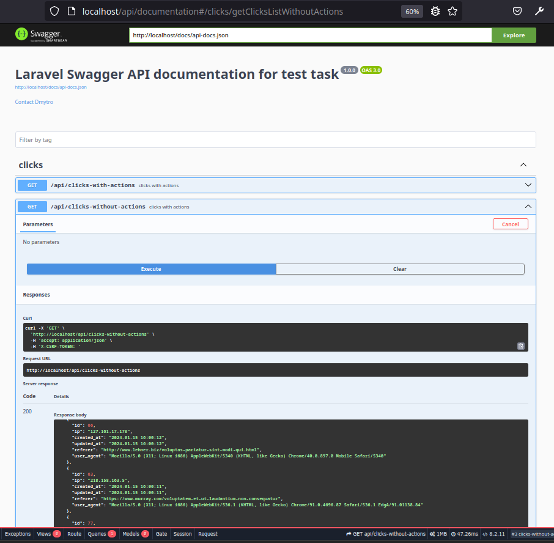

## Dmytro Kopylets
***

**my contacts:**
* dm.kopylets@gmail.com
* https://t.me/Dmytro_Kopylets

***

**My test work for getting a job as a Junior PHP Developer**

**Task 2 from 2**

***

Full text of the task here [task](TaskJuniorPhp.pdf)

##How do I test my code?

After git clone https://github.com/dmkopylets/abcGroupTest.git

**Part 1 from 2**

**to start the part1 program in the command line, use:**

make dc-build

make dc-up

make composer-i

make bash

**php task1.php app:generate** 

***

**Part 2 from 2**

**to build docker containers use:**

copy file .env.example to .env

make dc-build

**to start the containers use:**

make dc-up

**then install packages for vendors:**

make composer-i

**then initialize the database:**

make db-init

***

in the future could only use 
**make dc-up**

**it will be possible to test the application in a browser at localhost**

**  http://localhost/api/documentation - Swagger API documentation
        

and to stop docker containers use 
**make dc-down**

